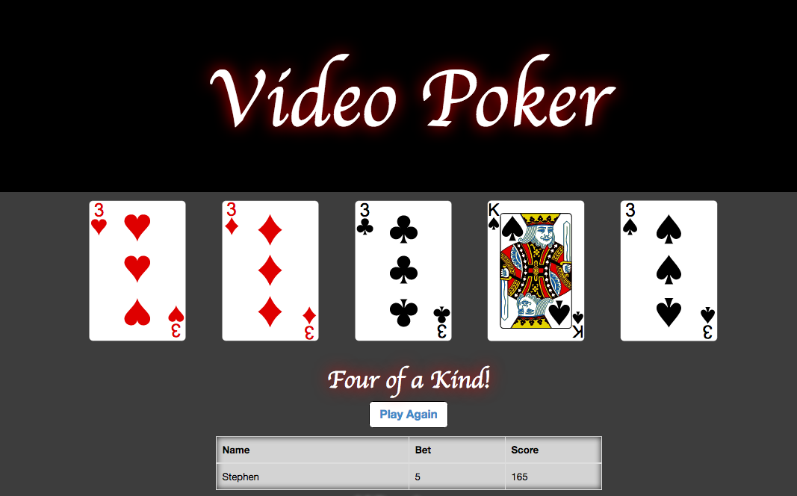

# _Video Poker_

#### _10-6-2016_

#### By _**Caleb Paul, Eric Krause, Stephen Emery, Blake Scala**_

## Description

_Video Poker is a 5 card draw poker_

_The game registers standard poker hand values, starting with face-value-pairs, up to a royal flush._
_The player can choose any number of cards from their hand to to exchange, in the hopes of getting a better set of cards from the next deal._

## Setup/Installation Requirements

* _Clone this repository (https://github.com/CalebPaul/poker.git) to your desktop_

* Type in terminal from desktop:
	`cd poker`

* Type in terminal:
	  `gradle run`

* Use web browser to navigate to:
	`localhost:4567`

## Known Bugs

_Player doesn't update when page is refreshed._
_Game doesn't trigger a 'lose screen' when player runs out of money._
_Clicking exchange cards with no cards selected results in a 500 error._

## Specifications
* On page load:
    - Site opens to an input page for player name
* On game page:
    - Site displays hand values and payouts
    - Player starts with 0 units to bet/gamble
    - Player can have a new hand dealt
    - Player can choose cards to exchange

## Support and contact details

_Caleb Paul: tweet - @calebpaulmusic_

_Eric Krause: krause197@gmail.com_

_Stephen Emery: https://github.com/Mehequanna_

_Blake Scala: blakescala@gmail.com_

## Technologies Used

_Bootstrap_
_Java_
_Gradle_
_Velocity Template Engine_
_Spark_
_PostgreSQL_

### License

*This webpage is licensed under the GPL license.*

Copyright (c) 2016 **_Caleb Paul, Eric Krause, Stephen Emery, Blake Scala_**
